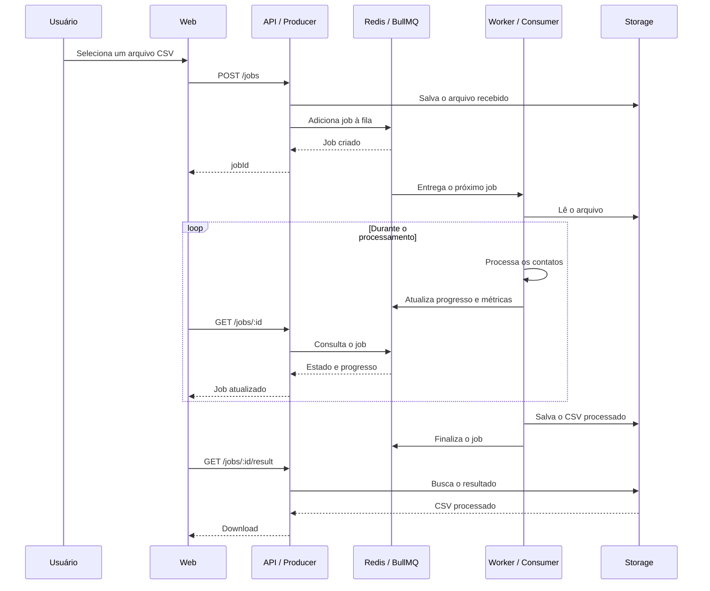

# QueueWorks

Experimento de processamento assíncrono com filas, usando BullMQ e Redis para desacoplar a criação de uma tarefa da sua execução por um Worker em background.

**Demo:** _em breve_ · **Post no Lab:** _em breve_

## Contexto

Uma operação rápida pode ser executada diretamente durante uma requisição HTTP sem nenhuma dificuldade:

```text
request
→ processamento
→ response
```

Esse modelo síncrono é simples e adequado quando o trabalho termina rapidamente. O problema aparece quando a operação demora mais, consome bastante CPU ou memória, depende de serviços externos, pode falhar temporariamente, chega em grande volume ou não precisa necessariamente terminar antes da resposta HTTP.

Nesse cenário, manter a requisição aberta até todo o trabalho terminar começa a acoplar duas responsabilidades diferentes: receber a solicitação e executar o trabalho.

Uma fila separa esses momentos:

```text
request
→ cria job
→ resposta com jobId

        ↓

fila
→ worker
→ processamento
→ resultado
```

A API passa a atuar como **Producer**. Ela recebe a solicitação, salva os dados necessários, cria um job, coloca esse job na fila e responde rapidamente.

O Worker atua como **Consumer**. Ele retira jobs da fila, executa o trabalho, atualiza o progresso e finaliza ou falha o job. A fila fica entre esses dois lados, permitindo que a duração do processamento não determine a duração da requisição original.

Uma fila não torna o processamento magicamente mais rápido. O benefício é arquitetural: ela permite controlar quando o trabalho será executado, quantos trabalhos podem ser executados simultaneamente, como eles aguardam capacidade disponível e qual é o estado do processamento. Também torna possível acompanhar progresso, tratar falhas e configurar retries quando essa capacidade fizer sentido.

Isso ajuda a criar **backpressure**. Se 500 arquivos chegam ao mesmo tempo, tentar processar todos em paralelo pode esgotar CPU, memória, conexões ou recursos externos. Com uma fila, os jobs podem esperar e os Workers consomem tarefas na velocidade que a infraestrutura suporta. A fila absorve a diferença entre a velocidade de entrada e a capacidade de processamento.

Esse modelo é útil para trabalhos como geração de relatórios, processamento de arquivos, importações, exportações, conversões, geração de thumbnails, envio de e-mails em lote e processamento de mídia — especialmente quando essas tarefas não precisam terminar dentro da requisição original.

Fila também adiciona complexidade. Se uma operação é rápida, simples e necessária para produzir a resposta imediatamente, executá-la diretamente durante a requisição pode ser a melhor solução. Uma fila não é uma solução universal.

O QueueWorks usa um CSV de contatos como workload para tornar esse comportamento observável. O arquivo segue o formato:

```csv
name,email,company
```

Cada job lê o arquivo, normaliza os registros, valida nome e e-mail, converte e-mails para minúsculo, identifica contatos inválidos e duplicados, mantém o primeiro contato válido de cada e-mail, gera um novo CSV com contatos válidos e únicos e atualiza progresso e métricas durante a execução.

As métricas acompanhadas são `received`, `valid`, `invalid` e `duplicates`. O CSV é apenas o trabalho executado pelo Worker; o experimento é sobre desacoplar esse trabalho da requisição HTTP através de uma fila de jobs.

Os estados mais importantes de um job são:

```text
waiting
↓
active
↓
completed
```

ou:

```text
waiting
↓
active
↓
failed
```

Um job `waiting` aguarda um Worker, `active` está sendo processado, `completed` terminou e `failed` terminou com erro. Também pode existir o estado `delayed` quando a execução é adiada.

O Redis não armazena os arquivos CSV. O BullMQ usa o Redis para manter a fila, os dados do job, o estado, o progresso e o resultado associado ao job:

```text
Redis / BullMQ
→ fila
→ dados do job
→ estado
→ progresso
→ resultado associado ao job
```

Os arquivos ficam separados no storage:

```text
storage/uploads
→ arquivos recebidos

storage/results
→ arquivos processados
```

O projeto é um monorepo pequeno organizado com **pnpm workspaces**, contendo apenas `apps/web` e `apps/api`. O Worker não é uma terceira aplicação: ele roda junto da API e consome a fila configurada no BullMQ.

## Stack

### Web

| Tecnologia         | Uso                                |
| ------------------ | ---------------------------------- |
| React + TypeScript | Interface                          |
| TanStack Query     | Estado assíncrono, cache e polling |
| Axios              | Cliente HTTP                       |
| Tailwind CSS       | Estilização                        |
| Tailwind Variants  | Variantes dos componentes de UI    |
| Radix UI           | Primitivos acessíveis              |
| Sonner             | Feedback da interface              |
| Lucide React       | Ícones                             |
| Vite               | Desenvolvimento e build            |

### API

| Tecnologia           | Uso                                    |
| -------------------- | -------------------------------------- |
| Express + TypeScript | API HTTP                               |
| BullMQ               | Fila e gerenciamento dos jobs          |
| Redis                | Persistência da fila e estado dos jobs |
| ioredis              | Conexão com o Redis                    |
| csv-parse            | Leitura dos arquivos CSV               |
| Zod                  | Validação e normalização dos contatos  |
| Multer               | Recebimento dos arquivos               |
| CORS                 | Comunicação entre Web e API            |

As rotas usadas pelo experimento são:

```text
POST   /jobs
GET    /jobs
GET    /jobs/:id
GET    /jobs/:id/result
DELETE /jobs/:id
GET    /health
```

`POST /jobs` cria o job. `GET /jobs` lista jobs recentes. `GET /jobs/:id` consulta estado e progresso. `GET /jobs/:id/result` baixa o resultado. `DELETE /jobs/:id` remove o job e seus arquivos.

## Fluxo de um job



---

Construído por [Arthur Reis](https://buildwitharthur.com.br) como parte do [ArthurLabs Lab](https://arthurlabs.io).
