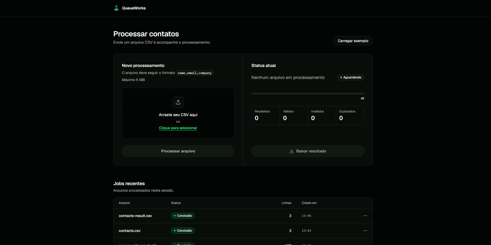
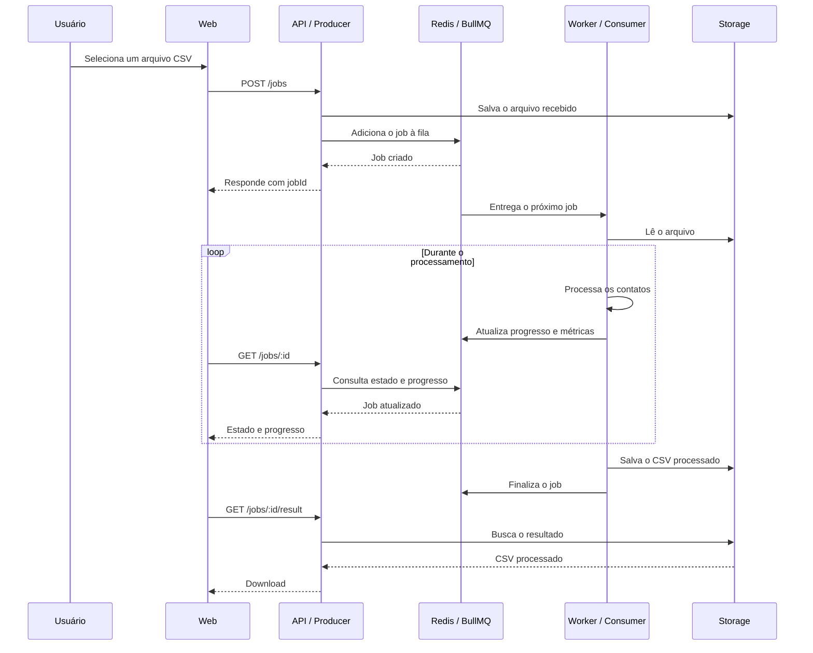

# QueueWorks

Experimento de processamento assíncrono com **jobs**, filas e Workers, para estudar como desacoplar uma requisição HTTP de um trabalho demorado.

**Demo:** 

**Post no Lab:** _em breve_

## Contexto

Uma operação rápida pode ser executada diretamente durante uma requisição HTTP:

```text
request
→ processamento
→ response
```

Esse modelo síncrono é simples quando o trabalho termina rapidamente. O problema aparece quando a operação demora, consome muitos recursos, depende de serviços externos, pode falhar temporariamente ou chega em grande volume. Manter a requisição aberta até o fim do processamento mistura duas responsabilidades: receber a solicitação e executar o trabalho.

Uma fila separa esses momentos:

```text
request
→ cria job
→ responde com jobId

        ↓

fila
→ Worker
→ processamento
→ resultado
```

Neste experimento, a API atua como **Producer**. Ela recebe a solicitação, salva o arquivo enviado, cria um **job** — a unidade de trabalho — e o coloca na fila. O **Redis com BullMQ** atua como **Queue**, mantendo os jobs e seus estados enquanto aguardam capacidade de processamento. O **Worker** atua como **Consumer**, retira um job da fila, executa o trabalho e registra seu progresso e resultado.

A Web não precisa manter a requisição original aberta. Depois de receber o `jobId`, ela consulta a API periodicamente por **polling** para acompanhar o estado, o progresso e as métricas do job. Quando o processamento termina, o resultado pode ser baixado separadamente.

Uma fila não torna o processamento magicamente mais rápido. Ela organiza a capacidade disponível, define quais trabalhos aguardam, limita quantos podem ser executados ao mesmo tempo e mantém informações sobre progresso e falhas. Isso cria **backpressure**: se muitos arquivos chegam simultaneamente, os jobs podem esperar na fila enquanto os Workers consomem tarefas na velocidade que a infraestrutura suporta, sem tentar processar tudo em paralelo.

Filas fazem sentido quando o trabalho pode demorar, precisa de retry, chega em volume ou não precisa terminar antes da resposta HTTP — como relatórios, importações, conversões e processamento de arquivos. Para uma operação pequena, rápida e necessária para produzir a resposta imediatamente, o processamento síncrono costuma ser mais simples e adequado. Uma fila adiciona capacidade de controle, mas também adiciona complexidade.

Os estados principais de um job são:

```text
waiting → active → completed
                     ↘ failed
```

Um job `waiting` aguarda um Worker, `active` está em execução, `completed` terminou com sucesso e `failed` terminou com erro. O estado `delayed` representa um job cuja execução foi adiada.

O Redis não armazena os arquivos CSV. O BullMQ usa o Redis para a fila, os dados dos jobs, os estados, o progresso e os resultados associados. Os arquivos ficam separados no storage:

```text
storage/uploads
→ arquivos recebidos

storage/results
→ arquivos processados
```

Para tornar o comportamento observável, o Worker processa um CSV de contatos com o formato `name,email,company`. Ele normaliza os registros, valida nome e e-mail, converte e-mails para minúsculo, identifica contatos inválidos e duplicados e gera um novo CSV com contatos válidos e únicos. As métricas acompanhadas são `received`, `valid`, `invalid` e `duplicates`. O CSV é o workload do experimento; o tema central é o desacoplamento entre a requisição e o processamento assíncrono.

## Stack

### Web

| Tecnologia | Uso |
| --- | --- |
| React + TypeScript | Interface |
| TanStack Query | Estado assíncrono, cache e polling |
| Axios | Cliente HTTP |
| Tailwind CSS | Estilização |
| Tailwind Variants | Variantes dos componentes |
| Radix UI | Primitivos acessíveis |
| Sonner | Feedback da interface |
| Lucide React | Ícones |
| Vite | Desenvolvimento e build |

### API

| Tecnologia | Uso |
| --- | --- |
| Express + TypeScript | API HTTP |
| BullMQ | Fila e gerenciamento dos jobs |
| Redis + ioredis | Persistência da fila e estado dos jobs |
| csv-parse | Leitura dos arquivos CSV |
| Zod | Validação e normalização dos contatos |
| Multer | Recebimento dos arquivos |
| CORS | Comunicação entre Web e API |

O monorepo usa **pnpm workspaces** e contém `apps/web` e `apps/api`. O Worker roda junto da API e consome a fila configurada no BullMQ.

## Rotas

```text
POST   /jobs
GET    /jobs
GET    /jobs/:id
GET    /jobs/:id/result
DELETE /jobs/:id
GET    /health
```

## Fluxo de um job



---

Construído por [Arthur Reis](https://buildwitharthur.com.br) como parte do [ArthurLabs Lab](https://arthurlabs.io).
